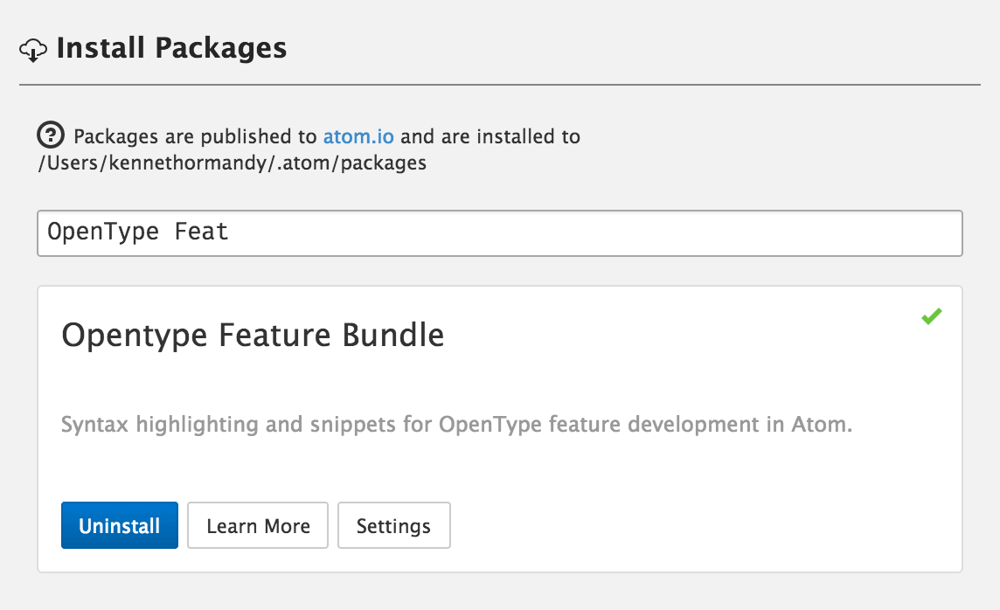

# OpenType Feature Bundle

This covers Adobe’s [OpenType Feature File Specification](http://partners.adobe.com/public/developer/opentype/afdko/topic_feature_file_syntax.html) used by the AFDKO. As well as syntax highlighting, there are also a couple of snippets for creating features, tables etc.

## Install

To add the package to Atom, search for the package “OpenType Feature Bundle.”

[](http://github.com/kennethormandy/opentype-feature-bundle)

#### With apm

Alternatively, you may use Atom’s command line tools if you already have them installed.

```sh
apm install opentype-feature-bundle
```

#### With other text editors

This repository only contains the source code for the Atom package, which is based upon [Brook Elgie’s original Textmate bundle](https://github.com/brew/opentype-feature-bundle).

- [Sublime Text](https://github.com/brew/opentype-feature-bundle#sublime-text-with-package-control)
- [Textmate](https://github.com/brew/opentype-feature-bundle#textmate-using-git)

## License

[The MIT License (MIT)](LICENSE.md)

Copyright © 2007–2014 [Brook Elgie](http://brookelgie.com)
Copyright © 2014 [Kenneth Ormandy](http://kennethormandy.com)
